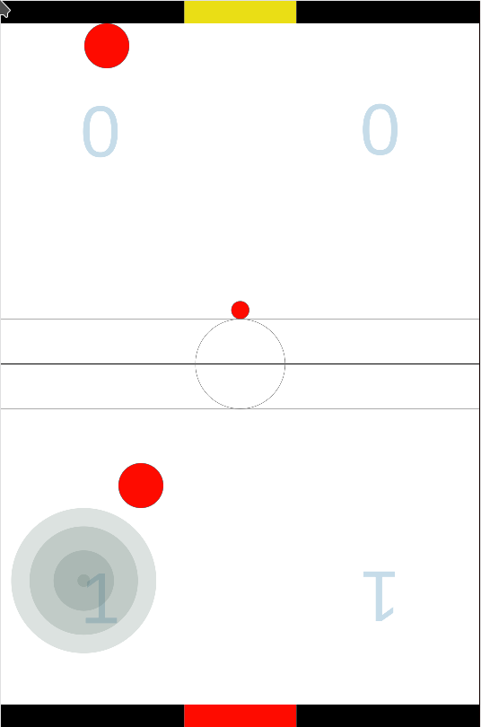

# AIrhockey IoT 4.0 extreme

A browser game created in the Human-Computer-Interaction course at University Esslingen.

The objective was to write a JavaScript and touch based game.

This is what we came up with.

You can play it directly [here](https://puengel.github.io/airhockey-iot-4.0-exreme/).  
It is best played on a large Screen like a tablet or a touch table.

